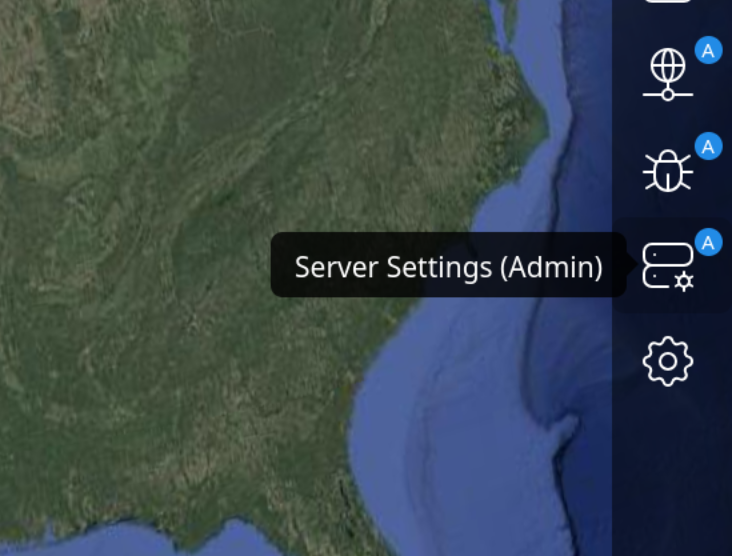
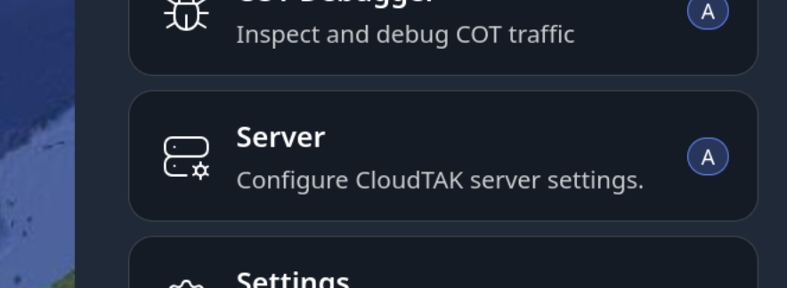
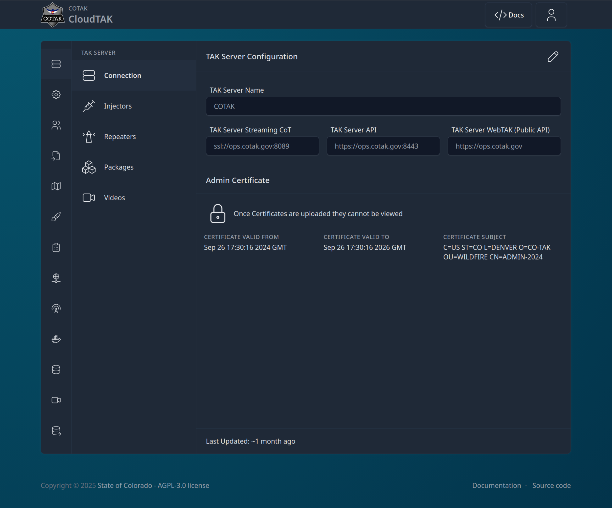
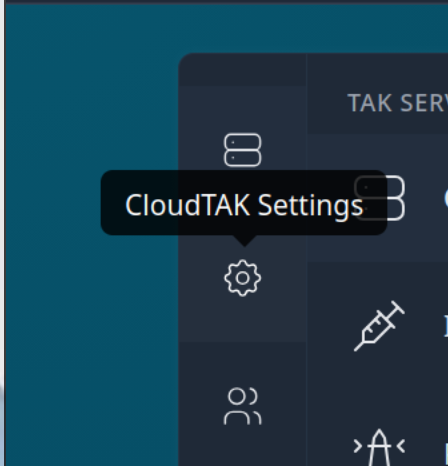
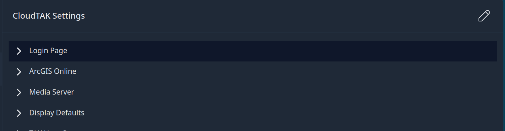
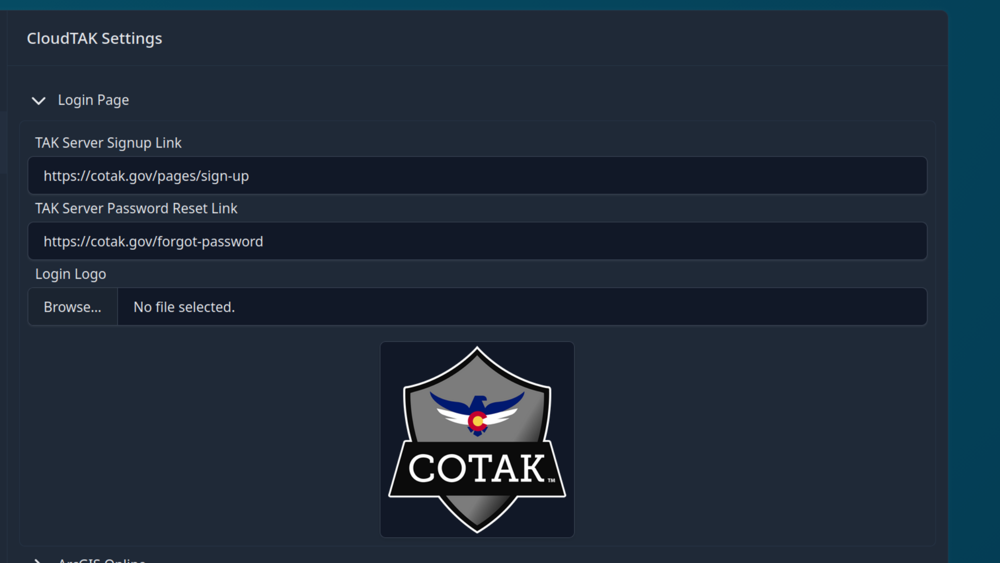

# CloudTAK Server Administration Guide

## Introduction

Welcome to the CloudTAK Server Administration Guide. This document provides comprehensive instructions for configuring, and managing the CloudTAK server.
Whether you are a system administrator or a technical user, this guide will help you ensure that your CloudTAK server is running smoothly and efficiently.

## Admin Panel

The admin panel can be accessed once logged in to the CloudTAK Map View.

| Large Device Side Menu                                                                                     | From within the Main Menu                                                                            |
| ---------------------------------------------------------------------------------------------------------- | ---------------------------------------------------------------------------------------------------- |
| { style="display: block; margin: 0 auto;" } | { style="display: block; margin: 0 auto;" } |

Once you enter the Admin Panel, you will get a screen like the following:

{ style="display: block; margin: 0 auto;" }

## CloudTAK Settings

The CloudTAK Settings section of the Admin Panel allows you to configure the default behavior of the CloudTAK server instance.

From the Admin Page, select the CloudTAK Settings Menu Item on the left:

{ style="display: block; margin: 0 auto;" }

### Server Branding

CloudTAK can be configured to use a custom logo and naming scheme to more easily identify and customize the server to fit your agency.

To configure, select the "Login Page" option and then the Pencil icon in the upper right-hand corner to edit.

{ style="display: block; margin: 0 auto;" }

Add any or all of the options you wish to customize and then select "Save Setting" in the bottom right.

{ style="display: block; margin: 0 auto;" }

## Basemaps & Overlays

You can enhance CloudTAK by configuring custom, high-quality basemaps and overlays to improve the user experience. CloudTAK supports a variety of map tile sources, including both standard raster imagery and modern vector tiles. You can upload or configure these sources, such as `.pmtiles` archives, to serve as global basemaps or specialized custom overlays.

If you are using vector basemaps, we highly recommend utilizing the standard [OpenMapTiles Style Sheets](https://github.com/openmaptiles/openmaptiles/tree/master/style) to customize the map aesthetics according to your needs.

To help you get started quickly with a global vector basemap, you can download our pre-generated `openmaptiles.pmtiles` file using the button below:

[Download openmaptiles.pmtiles](https://files.cloudtak.io/){ .md-button .md-button--primary }

### Hosted Tilesets

CloudTAK supports serving tiles diretly from a PMTiles Archive. To upload a PMTiles archive, from the Admin Page, navigate to the Hosted Tilesets Menu.

On the Hosted Tilesets page you can see a list of tilesets that are hosted on the server (If any).

To upload a new TileSet to the server, Click on the upload button in the upper-right-hand corner.

Find the file and then start the upload. 

> On the backend these tilesets will be uploaded to the `public/`prefix of the S3 Bucket or Compatible Store. Tiles are public to authenticated users of CloudTAK but _not_ to unauthenticated users. Tiles themselves are served via the PMTiles Task Server. 

Once the tiles have been uploaded, proceed to the next section to add a new Basemap or Overlay

### Basemap/Overlays

Basemaps and overlays are both layers on the map that will be visible to the user. The difference between the two are simply if the new layer should be added ontop of existing layers (an overlay), or if the layer should replace the bottom layer (a basemap). Both share the same functionality and as such we will refer to both as an overlay in this guide.

From the Server Admin page naviate to the Basemap & Overlay Menu

The Basemaps menu will show a list of current basemaps loaded into the server. By default only "public" basemaps are shown, public being basemaps that are avilable to all users of the system. 

Seeing a user's personal basemaps is possible when warranted by clicking on the "Filter" icon and choosing "All" or "User" from the dropdown list.

### Adding a Basemap or Overlay

1. Click on the Create Overlay button

2. The New Overlay Pane will open that depending on your version will look similiar to the panel below.

3. Choose a name for the basemap. Enable Sharing allows the user to share the basemap to other TAK users. Note that while disabling sharing makes it more difficult to share, the user is still able to see the tile URL and could create a personal overlay they could subsequently share. Hidden should typically only be used for snapping layers as this will cause the basemap not to be present in the default Basemap or Overlay menu.

4. If the basemap should be available to all users of the system leave the basemap as "Publically Shared", otherwise select a user from the dropdown to assign it to a specific user.

5. Choose the source of the Tiles, Manual Entry supports quadkey, zxy, and ESRI Servers. Some example URLs can be seen below.
   
   - ESRI ImageServer
     
     - `https://example.com/arcgis/rest/services/WorldImagery/ImageServer`
   
   - ESRI MapServer
     
     - `https://example.com/arcgis/rest/services/WorldTopo/MapServer/1`
   
   - ESRI FeatureServer
     
     - `https://example.com/arcgis/rest/services/Parcels/FeatureServer/1` 
   
   - ZXY
     
     -  `https://example.com/tiles/{$z}/{$x}/{$y}.png`
   
   - Quadkey
     
     - `https://example.com/tiles/{$q}.png`
   
   If adding a Hosted Tileset as uploaded in the previous section, select the "Public Tilesets" item and select the relevant tileset from the list.

## Connections & Data/ETL Integrations
