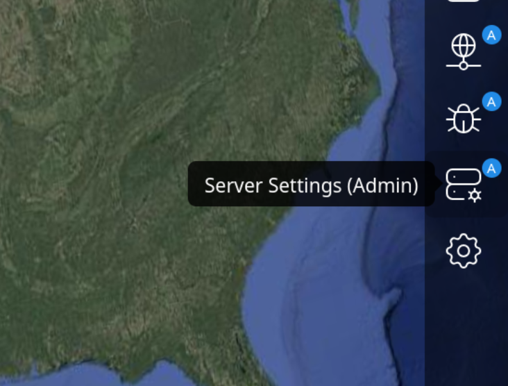
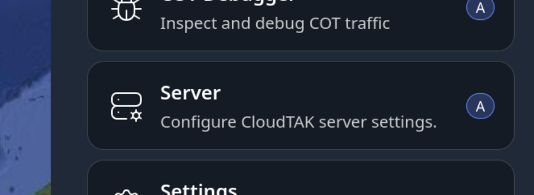
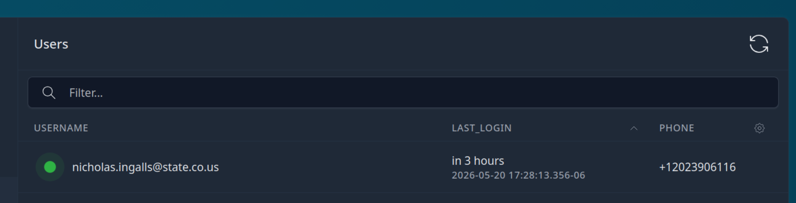
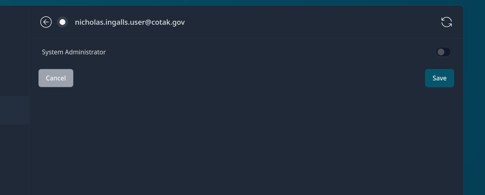

# CloudTAK Server Administration Guide

## Introduction

Welcome to the CloudTAK Server Administration Guide. This document provides comprehensive instructions for configuring, and managing the CloudTAK server.
Whether you are a system administrator or a technical user, this guide will help you ensure that your CloudTAK server is running smoothly and efficiently.

## Admin Panel

The admin panel can be accessed once logged in to the CloudTAK Map View.

| Large Device Side Menu                                          | From within the Main Menu                                 |
| --------------------------------------------------------------- | --------------------------------------------------------- |
|  |  |

Once you enter the Admin Panel, you will get a screen like the following:


## CloudTAK Settings

The CloudTAK Settings section of the Admin Panel allows you to configure the default behavior of the CloudTAK server instance.

From the Admin Page, select the CloudTAK Settings Menu Item on the left:


CloudTAK can be configured to use a custom logo and naming scheme to more easily identify and customize the server to fit your agency.

To configure, select the "Login Page" option and then the Pencil icon in the upper right-hand corner to edit.


Add any or all of the options you wish to customize and then select "Save Setting" in the bottom right.


## Authentication

Before changing any authentication settings it helps to understand what CloudTAK is actually doing when someone logs in. CloudTAK does not keep its own password database. Every login is verified against the TAK Server that the instance is connected to, and the first time a user signs in, CloudTAK requests a client certificate for them through the TAK Server's Certificate Enrollment API. That certificate is stored with the user's profile and is what CloudTAK uses for all TAK traffic on the user's behalf from then on. It is deliberately long-lived — CloudTAK reuses it across logins and only requests a new one when the existing certificate is within a week of expiring or has been revoked on the TAK Server.

That model explains most authentication problems you will run into: they are almost always either "the TAK Server rejected the credentials" or "a certificate could not be enrolled or renewed."

All of the settings below live in the same **Login Page** card described in the previous section (Admin Panel, then CloudTAK Settings, then Login Page, then the pencil icon to edit).

### Username & Password

This is the default method and needs no CloudTAK-side setup. Credentials are passed straight through to the TAK Server's WebTAK endpoint, so whatever backs authentication there — LDAP in most deployments, or the flat `UserAuthenticationFile.xml` — decides who can log in. If a user can authenticate against the TAK Server directly, they can log into CloudTAK.

Because the password is available at login time, certificate renewal is invisible with this method. When a certificate is close to expiry, CloudTAK quietly enrolls a fresh one during the next login.

### Passkeys

Passkeys are enabled by default and can be turned off with the **Enable Passkey Authentication** toggle. There is nothing else to configure server-side. Users register passkeys themselves from the main menu under Settings once they are logged in, and after that the login page will offer passkey autofill in supporting browsers.

One behavior worth knowing about: a passkey can prove who the user is, but it cannot renew their TAK certificate, since renewal requires a credential the TAK Server accepts. If a user logs in with a passkey while their certificate is about to expire, CloudTAK will let them in but prompt them for their password once to complete the renewal. Users who only ever log in with a passkey will see this roughly once a year, depending on the certificate lifetime your TAK Server issues.

### Single Sign-On (OIDC)

!!! warning "Beta"
    OIDC SSO is currently a beta feature. Test it against a staging instance with **Enforce SSO** left off before you rely on it in production.

CloudTAK can hand the login flow to any OpenID Connect identity provider that supports the standard Authorization Code flow and publishes a discovery document — Authentik, Keycloak, Entra ID, Okta, and friends. The user clicks the SSO button, authenticates with the IdP, and lands back in CloudTAK with a session.

The certificate model from the top of this section still applies, and it is the part that makes SSO setup a two-sided job. When a brand-new user signs in via SSO there is no password available, so CloudTAK enrolls their certificate by presenting the IdP's access token to the TAK Server instead. For that to work, the TAK Server has to be configured to trust your IdP — see the CoreConfig step below. Returning users with a valid certificate never touch the enrollment path, so a per-login flood of new certificates is explicitly *not* something you need to worry about; one user holds one certificate until it approaches expiry.

#### 1. Register CloudTAK with your Identity Provider

Create a confidential (server-side) OAuth application in your IdP with:

- **Grant type:** Authorization Code
- **Redirect URI:** `https://<your-cloudtak-host>/api/login/oidc/callback`
- **Scopes:** `openid profile email`

The `email` part matters more than it might look. CloudTAK uses the `email` claim from the IdP as the CloudTAK username *and* as the certificate identity, so the provider must include it in UserInfo responses, and the addresses must match the identities your TAK Server already knows about. If your TAK Server authenticates against the same directory your IdP does (the usual setup — for example Authentik fronting the same LDAP), this lines up automatically. If the two disagree, SSO users will enroll certificates under names your TAK Server groups don't recognize, and channel membership will be wrong.

#### 2. Configure CloudTAK

Back in the Login Page settings card, turn on **Enable OIDC SSO** and fill in:

| Field             | What to enter                                                                                          |
| ----------------- | ------------------------------------------------------------------------------------------------------ |
| Provider Name     | The label on the login button, e.g. "Sign in with *Acme SSO*"                                          |
| OIDC Discovery URL | The provider's `.well-known/openid-configuration` URL                                                  |
| Client ID         | From the application you registered in step 1                                                          |
| Client Secret     | Same                                                                                                    |
| Redirect URI      | Leave blank — CloudTAK defaults to `/api/login/oidc/callback` on its own public URL. Only set this if a proxy rewrites your hostname |
| Scopes            | Leave blank for the default `openid profile email`                                                     |
| OIDC Logo         | Optional icon shown on the login button                                                                |

A couple of concrete discovery URL examples, since every provider hides them somewhere different:

- Authentik: `https://auth.example.com/application/o/<app-slug>/.well-known/openid-configuration`
- Keycloak: `https://auth.example.com/realms/<realm>/.well-known/openid-configuration`

Leave **Enforce SSO** off for now. With it off, the SSO button simply appears alongside the normal username/password form, which gives you a safe way to test.

#### 3. Trust the IdP on the TAK Server

This is the step that is easy to miss because everything *appears* to work without it — existing users can SSO in just fine on their stored certificates. It only breaks when a new user tries to sign in for the first time, or when someone's certificate comes up for renewal, because that is when CloudTAK presents the IdP access token to the TAK Server's enrollment endpoint.

In `CoreConfig.xml`, add an OpenID Connect entry inside the `<auth><oauth>` block:

```xml
<auth default="ldap" ...>
    <ldap .../>
    <oauth usernameClaim="email">
        <openIdDiscoveryConfiguration
            name="cloudtak-sso"
            clientId="<same client id as above>"
            secret="<same client secret>"
            redirectUri="https://<your-cloudtak-host>/api/login/oidc/callback"
            configurationUri="https://<idp>/.well-known/openid-configuration"/>
    </oauth>
</auth>
```

Setting `usernameClaim="email"` is recommended so the TAK Server derives the same identity from the token that CloudTAK does. The TAK Server only reads its OAuth configuration at startup, so restart it after editing.

!!! note
    The TAK Server fetches the discovery document and the IdP's signing keys itself, so the TAK Server needs network reach to the IdP and the discovery document must include a `scopes_supported` entry — a few IdPs omit it, and the TAK Server treats that as a hard error.

#### 4. Test, then enforce

Log in through the SSO button as an existing user first (this exercises the token exchange but reuses their certificate), then as a user who has never logged into CloudTAK (this exercises certificate enrollment, the TAK-side trust from step 3). Once both work, you can turn on **Enforce SSO (Disable Username/Password Login)** to make the IdP the only way in.

#### Troubleshooting

Failures during the SSO round-trip come back to the login page as a red "SSO Login Failed" banner with a short reason. The ones you are most likely to meet:

- **"OIDC UserInfo did not return an email claim"** — the IdP isn't releasing the email. Check that the application grants the `email` scope and that the user actually has an email address set.
- **Existing users work, new users fail** — almost always step 3. The TAK Server unfortunately reports enrollment failures as a bare HTTP 500 with no detail, so check `takserver-api.log` on the TAK Server itself; a "HttpUser didn't equal CN" line means the identity the TAK Server derived from the token doesn't match the email CloudTAK put in the certificate request — set `usernameClaim="email"` on the `<oauth>` element.
- **Changes to CoreConfig seem to have no effect** — the OAuth section requires a TAK Server restart, unlike most other CoreConfig values.
- **You enforced SSO and locked yourself out** — an administrator token can still flip the setting back via the API (`PUT /api/config` with `{"oidc::enforced": false}`), or as a last resort delete the row directly: `DELETE FROM settings WHERE key = 'oidc::enforced';` in the CloudTAK database.

## Basemaps & Overlays

You can enhance CloudTAK by configuring custom, high-quality basemaps and overlays to improve the user experience. CloudTAK supports a variety of map tile sources, including both standard raster imagery and modern vector tiles. You can upload or configure these sources, such as `.pmtiles` archives, to serve as global basemaps or specialized custom overlays.

If you are using vector basemaps, we highly recommend utilizing the standard [OpenMapTiles Style Sheets](https://github.com/openmaptiles/openmaptiles/tree/master/style) to customize the map aesthetics according to your needs.

To help you get started quickly with a global vector basemap, you can download our pre-generated `openmaptiles.pmtiles` file using the button below:

<div align="center" markdown="1">
[Download openmaptiles.pmtiles](https://files.cloudtak.io/){ .md-button .md-button--primary }
</div>

### Hosted Tilesets

CloudTAK supports serving tiles diretly from a PMTiles Archive. To upload a PMTiles archive, from the Admin Page, navigate to the Hosted Tilesets Menu.


On the Hosted Tilesets page you can see a list of tilesets that are hosted on the server (If any).


To upload a new TileSet to the server, Click on the upload button in the upper-right-hand corner.


Find the file and then start the upload. 

> On the backend these tilesets will be uploaded to the `public/`prefix of the S3 Bucket or Compatible Store. Tiles are public to authenticated users of CloudTAK but _not_ to unauthenticated users. Tiles themselves are served via the PMTiles Task Server. 

Once the tiles have been uploaded, proceed to the next section to add a new Basemap or Overlay

### Basemap/Overlays

Basemaps and overlays are both layers on the map that will be visible to the user. The difference between the two are simply if the new layer should be added ontop of existing layers (an overlay), or if the layer should replace the bottom layer (a basemap). Both share the same functionality and as such we will refer to both as an overlay in this guide.

From the Server Admin page naviate to the Basemap & Overlay Menu


The Basemaps menu will show a list of current basemaps loaded into the server. By default only "public" basemaps are shown, public being basemaps that are avilable to all users of the system. 


Seeing a user's personal basemaps is possible when warranted by clicking on the "Filter" icon and choosing "All" or "User" from the dropdown list.


### Adding a Basemap or Overlay

1. Click on the Create Overlay button


2. The New Overlay Pane will open that depending on your version will look similiar to the panel below.


3. Choose a name for the basemap. Enable Sharing allows the user to share the basemap to other TAK users. Note that while disabling sharing makes it more difficult to share, the user is still able to see the tile URL and could create a personal overlay they could subsequently share. Hidden should typically only be used for snapping layers as this will cause the basemap not to be present in the default Basemap or Overlay menu.

4. If the basemap should be available to all users of the system leave the basemap as "Publically Shared", otherwise select a user from the dropdown to assign it to a specific user.

5. Choose the source of the Tiles, Manual Entry supports quadkey, zxy, and ESRI Servers. Some example URLs can be seen below.
   
   - ESRI MapServer
   
     - `https://example.com/arcgis/rest/services/WorldTopo/MapServer/1`
   
   - ESRI FeatureServer
   
     - `https://example.com/arcgis/rest/services/Parcels/FeatureServer/1`
   
   - ZXY
   
     -  `https://example.com/tiles/{$z}/{$x}/{$y}.png`
   
   - Quadkey
   
     - `https://example.com/tiles/{$q}.png`
   
   If adding a Hosted Tileset as uploaded in the previous section, select the "Hosted Tilesets" item and select the relevant tileset from the list.

## Terrain

CloudTAK has support for a 2.5D environment if loaded with a DEM dataset. To do so, navigate to the Basemap/Overlay section of the Admin Panel as described above.

Create a new Basemap and select the "TileJSON Import" object from the protocol options


You can provide your own DEM source if it is in the mapbox or terrarium tile format, or use Mapterhorn, a high quality, free global elevation dataset.

If using Mapterhorn, paste the TileJSON URL

> https://tiles.mapterhorn.com/tilejson.json

and select, "Fetch TileJSON"


If using the CloudTAK provided Mapterhorn snapping file, set the following values before saving. Some of these fields are only visible once the "Advanced Options" section is expanded.

| Setting          | Value       | Location         |
| ---------------- | ----------- | ---------------- |
| Name              | Mapterhorn DEM | Main form      |
| Enable Sharing    | Off         | Main form         |
| Type              | raster-dem  | Advanced Options  |
| Terrain Encoding  | terrarium   | Advanced Options  |
| Min Zoom          | 14          | Advanced Options  |
| Max Zoom          | 14          | Advanced Options  |
| Tile Size         | 512         | Advanced Options  |
| Format            | webp        | Advanced Options  |

Click save. To enable the layer as the default CloudTAK Terrain source and show the 3D terrain button on the map, navigate to the CloudTAK Settings option on the Admin Panel, then Map Settings


Click the Edit Pencil in the upper right-hand corner and select the DEM source that you created in the previous step.


Finally click the save button in the upper right hand corner to save the new default terrain layer. Log out and then log back in and the map view will show the 3d terrain option (The Mountain Icon)


# # Users

The CloudTAK Users section of the Admin Panel allows you to view and configure data about active users of CloudTAK


From the Admin Panel, select the user's Menu Entry on the left.



A list of users that have accessed the CloudTAK platform will appear, sorted by most recent. A green status icon indicates that they are actively connected to the CloudTAK Service.

Clicking on a user will open the user profile view


From here, admins can see default settings that the user has selected as well as editing their access level. To edit the user's access level, select the gear icon in the upper right-hand corner. An edit page will open that will allow you to indicate that a user is a System Administrator or a General User


