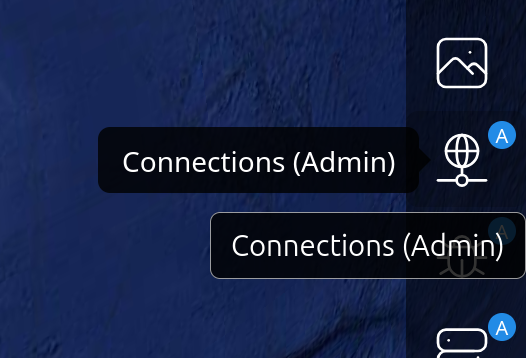
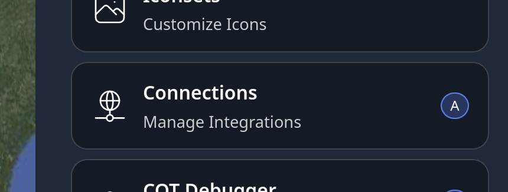

# CloudTAK Extraction, Transformation, and Load (ETL)

## Introduction

CloudTAK provides a robust ETL (Extraction, Transformation, and Load) framework that allows users to seamlessly integrate data from various sources into the CloudTAK ecosystem.
This document outlines the key components and processes involved in CloudTAK's ETL integrations.

### Connections

Connections form the core container through which integrations push or pull data into and out of the TAK ecosystem.

Connections at their core are a single private/public key certificate pair.

Connections can be access from the CloudTAK Main Menu:

| Large Device Side Menu                    | From within the Main Menu                 |
| ----------------------------------------- | ----------------------------------------- |
|  |  |

## Publishing an ETL Task

Before an ETL task can be used inside CloudTAK it must be built into a Docker
container, pushed to the AWS Elastic Container Registry (ECR), and registered as
an Integration via the CloudTAK Admin UI.

### Build & Push the Docker Container to ECR

1. **Set the version.** Open the ETL task's `package.json` and ensure the
   `version` field is set to the version you intend to build. This value is used
   as the container image tag in ECR.

2. **Configure AWS credentials.** Ensure valid AWS credentials are present in
   your current shell environment. The build script requires the following
   environment variables to be set:

    | Variable         | Description                                              |
    | ---------------- | -------------------------------------------------------- |
    | `AWS_REGION`     | The AWS region your CloudTAK deployment lives in.        |
    | `AWS_ACCOUNT_ID` | The 12 digit AWS account ID hosting the ECR repository.  |
    | `Environment`    | (Optional) Deployment environment. Defaults to `prod`.   |

    !!! note
        Standard AWS credential environment variables (`AWS_ACCESS_KEY_ID`,
        `AWS_SECRET_ACCESS_KEY`, and `AWS_SESSION_TOKEN` if applicable) must also
        be present so the build script can authenticate against ECR.

3. **Run the build script.** From the root of the ETL task directory, run the
   CloudTAK build script, pointing it at the current directory (`.`):

    ```sh
    node ../<path-to-cloudtak>/bin/build.js .
    ```

    Replace `<path-to-cloudtak>` with the relative path to your local checkout of
    the CloudTAK repository. The script will:

    - Build a Docker image named after the ETL's git repository.
    - Tag the image using the repository name and the `package.json` version
      (e.g. `etl-arcgis-v1.0.0`).
    - Authenticate with and push the image to the CloudTAK tasks ECR repository.

### Register the Integration in the Admin UI

Once the container has been pushed to ECR, register it so CloudTAK can discover
the available versions.

1. Navigate to the CloudTAK Admin UI at `map.<your-domain>/admin`.

2. Open the **Integrations** section and click the **+** button in the upper
   right corner.

3. Fill in the integration details:

    | Field            | Description                                                                                          |
    | ---------------- | ---------------------------------------------------------------------------------------------------- |
    | Name             | A human readable name for the integration.                                                           |
    | Container Prefix | The name of the git repository the ETL task is stored in (e.g. `etl-arcgis`).                        |

    !!! important
        The Container Prefix **must** match the git repository name used during
        the build, as this is how CloudTAK locates the pushed container images in
        ECR.

4. Click **Save**, then open the newly created Integration. The version you built
   and pushed earlier should now be listed as an available version.

5. With the Integration registered, an ETL layer can now be created inside a new
   or existing [Connection](#connections).
