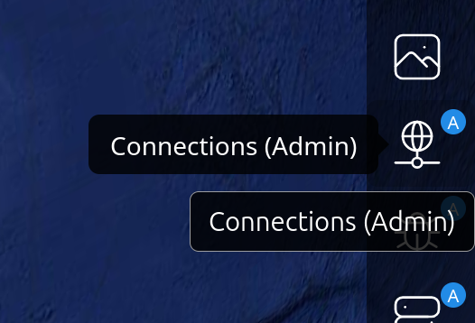
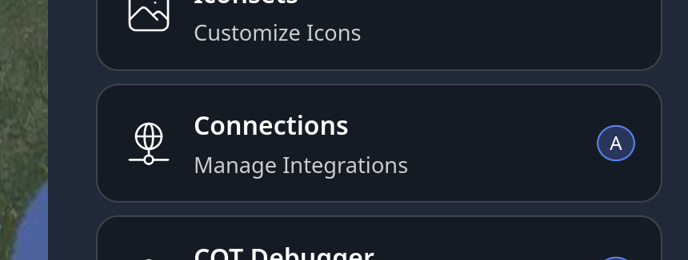

# CloudTAK Extraction, Transformation, and Load (ETL)

## Introduction

CloudTAK provides a robust ETL (Extraction, Transformation, and Load) framework that allows users to seamlessly integrate data from various sources into the CloudTAK ecosystem.
This document outlines the key components and processes involved in CloudTAK's ETL integrations.

### Connections

Connections form the core container through which integrations push or pull data into and out of the TAK ecosystem.

Connections at their core are a single private/public key certificate pair.

Connections can be access from the CloudTAK Main Menu:

| Large Device Side Menu                    | From within the Main Menu                 |
| ----------------------------------------- | ----------------------------------------- |
|  |  |

## Publishing an ETL Task

Before an ETL task can be used inside CloudTAK it must be built into a Docker
container, pushed to the AWS Elastic Container Registry (ECR), and registered as
an Integration via the CloudTAK Admin UI.

### Build & Push the Docker Container to ECR

ETL containers are built and pushed with the `cloudtak-etl` CLI, which is
published as part of the [@tak-ps/etl](https://github.com/dfpc-coe/etl-base)
package (v10.10.0 or newer).

#### Prerequisites

- [Node.js](https://nodejs.org/en) v24 or newer
- [Docker](https://www.docker.com/) with the `buildx` plugin (included in modern
  Docker installs)
- The [AWS CLI](https://aws.amazon.com/cli/), used to authenticate Docker
  against ECR

#### Install the CLI

ETL tasks built on the ETL Base library already have `@tak-ps/etl` as a
dependency, so from the root of the ETL task directory a plain `npm install`
makes the CLI available via `npx`:

```sh
npm install
npx cloudtak-etl --help
```

Alternatively the CLI can be installed globally, making `cloudtak-etl`
available in any ETL repository:

```sh
npm install --global @tak-ps/etl
```

#### Build & Push

1. **Author a `capabilities.json`.** The CLI requires a `capabilities.json`
   document in the root of the ETL repository, describing the task, the
   permissions it needs, and the invocation modes it supports:

    ```json
    {
        "version": "1.0.0",
        "name": "ArcGIS ETL",
        "description": "Pull features from an ArcGIS Feature Server",
        "permissions": [{
            "resource": "feature:*",
            "required": true,
            "description": "Write features to the connection"
        }],
        "compute": {
            "memory": 512,
            "timeout": 300
        },
        "invocations": {
            "incoming": {
                "schedule": {
                    "description": "Poll the Feature Server on a schedule",
                    "default": {
                        "enabled": true,
                        "schedule": "rate(1 minute)"
                    }
                }
            }
        }
    }
    ```

    The document is validated against the `StaticCapabilities` schema exported
    by `@tak-ps/etl` and embedded in the container's OCI Image Manifest, where
    the CloudTAK API reads it directly from ECR.

2. **Set the version.** Open the ETL task's `package.json` and ensure the
   `version` field is set to the version you intend to build. This value is used
   as the container image tag in ECR.

3. **Configure AWS credentials.** Ensure valid AWS credentials are present in
   your current shell environment. The CLI requires the following environment
   variables to be set:

    | Variable         | Description                                              |
    | ---------------- | -------------------------------------------------------- |
    | `AWS_REGION`     | The AWS region your CloudTAK deployment lives in.        |
    | `AWS_ACCOUNT_ID` | The 12 digit AWS account ID hosting the ECR repository.  |
    | `Environment`    | (Optional) Deployment environment. Defaults to `prod`.   |

    !!! note
        Standard AWS credential environment variables (`AWS_ACCESS_KEY_ID`,
        `AWS_SECRET_ACCESS_KEY`, and `AWS_SESSION_TOKEN` if applicable) must also
        be present so the CLI can authenticate against ECR.

4. **Run the CLI.** From the root of the ETL task directory:

    ```sh
    npx cloudtak-etl
    ```

    The CLI will:

    - Authenticate Docker against the CloudTAK tasks ECR repository.
    - Validate the `capabilities.json` document and embed it in the image
      manifest as an OCI annotation.
    - Build a `linux/amd64` Docker image named after the ETL's git repository.
    - Tag and push the image using the repository name and the `package.json`
      version (e.g. `tak-vpc-prod-cloudtak-tasks:etl-arcgis-v1.0.0`).

### Register the Integration in the Admin UI

Once the container has been pushed to ECR, register it so CloudTAK can discover
the available versions.

1. Navigate to the CloudTAK Admin UI at `map.<your-domain>/admin`.

2. Open the **Integrations** section and click the **+** button in the upper
   right corner.

3. Fill in the integration details:

    | Field            | Description                                                                                          |
    | ---------------- | ---------------------------------------------------------------------------------------------------- |
    | Name             | A human readable name for the integration.                                                           |
    | Container Prefix | The name of the git repository the ETL task is stored in (e.g. `etl-arcgis`).                        |

    !!! important
        The Container Prefix **must** match the git repository name used during
        the build, as this is how CloudTAK locates the pushed container images in
        ECR.

4. Click **Save**, then open the newly created Integration. The version you built
   and pushed earlier should now be listed as an available version.

5. With the Integration registered, an ETL layer can now be created inside a new
   or existing [Connection](#connections).
