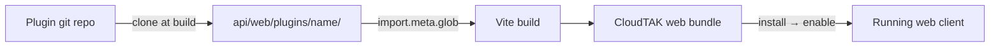

# Building CloudTAK Plugins

CloudTAK plugins let you extend the web client with new menus, routes, map
overlays, status‑bar widgets, and floating panes — without forking CloudTAK
itself. A plugin is a small standalone Vue/TypeScript project that is compiled
**into** the CloudTAK web bundle at build time.

This guide walks through the plugin contract, the Plugin API, scaffolding a new
plugin from the official sample, developing it locally against CloudTAK, and
deploying it into a production build.

!!! note
    The reference implementation for everything on this page is the
    [`cloudtak-plugin-sample`](https://github.com/dfpc-coe/cloudtak-plugin-sample)
    repository. When in doubt, copy from there.

## How plugins work

Plugins are **build‑time** extensions, not runtime downloads. The flow is:

1. Each plugin is a git repository that exports a single default class.
2. At build time, CloudTAK clones the configured plugin repositories into
   `api/web/plugins/<name>/`.
3. Vite discovers them with `import.meta.glob(['../plugins/*.ts', '../plugins/*/index.ts'])`
   and bundles them directly into the web client.
4. When the app boots, CloudTAK calls each plugin's `install()` hook, then
   `enable()` once the map is ready (and `disable()` when it tears down).

Because plugins are compiled into the bundle, they have full type‑safe access to
the CloudTAK Plugin API and to shared UI primitives from
[`@tak-ps/vue-tabler`](https://www.npmjs.com/package/@tak-ps/vue-tabler).



## The plugin contract

Every plugin exports a **default class** that implements two interfaces from
`@tak-ps/cloudtak`:

- `PluginStatic` — a static `install()` method used to construct the plugin.
- `PluginInstance` — instance `enable()` and `disable()` methods that add and
  remove the plugin's functionality.

```ts
import type { App } from 'vue';
import type { PluginAPI, PluginInstance } from '@tak-ps/cloudtak';

export default class MyPlugin implements PluginInstance {
    api: PluginAPI;

    constructor(api: PluginAPI) {
        this.api = api;
    }

    // Called once on init. Do NOT expose functionality here yet —
    // just construct the instance.
    static async install(app: App, api: PluginAPI): Promise<PluginInstance> {
        return new MyPlugin(api);
    }

    // Called when the map is loaded / the user opts in.
    // Register menus, routes, widgets, etc. here.
    async enable(): Promise<void> {
        // ...
    }

    // Called when the plugin is disabled.
    // Remove EVERYTHING you added in enable().
    async disable(): Promise<void> {
        // ...
    }
}
```

### Lifecycle

| Hook | When it runs | What to do |
| --- | --- | --- |
| `static install(app, api)` | Once, during app initialization | Construct and return your instance. Avoid side effects. |
| `enable()` | When the map becomes ready, or the user opts in | Add menus, routes, bottom‑bar items, floating panes, subscriptions. |
| `disable()` | When the plugin is turned off | Remove every menu, route, widget, and listener you added. |

!!! warning
    `enable()` and `disable()` must be symmetric. Anything registered in
    `enable()` has to be cleaned up in `disable()`, otherwise disabling the plugin
    will leave orphaned menus or routes behind.

## Prerequisites

- `git`
- Node.js `24.x` and `npm`
- Familiarity with Vue 3 (Composition API) and TypeScript
- A local CloudTAK checkout — see the [Develop guide](./develop.md)

## Scaffolding a new plugin

The fastest way to start is to clone the sample and rename it.

```sh
git clone https://github.com/dfpc-coe/cloudtak-plugin-sample.git my-cloudtak-plugin
cd my-cloudtak-plugin
rm -rf .git && git init
```

A plugin project is small. The important files are:

```
my-cloudtak-plugin/
├── index.ts            # Plugin entry point (default export class)
├── package.json
├── tsconfig.json
├── eslint.config.js
├── env.d.ts            # Type shims for .vue and .svg imports
└── lib/                # Your Vue components, icons, and assets
```

### `package.json`

Point `@tak-ps/cloudtak` at your local CloudTAK web package so you get types and
the Plugin API. Everything the plugin needs at build time lives in
`devDependencies` — the plugin is compiled into CloudTAK, so it does not ship its
own runtime dependencies.

```json
{
  "name": "my-cloudtak-plugin",
  "version": "1.0.0",
  "type": "module",
  "main": "index.js",
  "scripts": {
    "lint": "eslint .",
    "check": "vue-tsc --noEmit"
  },
  "devDependencies": {
    "@eslint/js": "^10.0.1",
    "@tak-ps/cloudtak": "file:../CloudTAK/api/web",
    "@tak-ps/vue-tabler": "^4.2.1",
    "typescript": "^6.0.2",
    "typescript-eslint": "^8.52.0",
    "vue": "^3.5.26",
    "vue-tsc": "^3.2.2"
  }
}
```

!!! tip
    The `@tak-ps/cloudtak` alias resolves to `CloudTAK/api/web` — the same package
    that Vite exposes internally as `@tak-ps/cloudtak`. Adjust the relative
    `file:` path to match where you checked out CloudTAK.

### `tsconfig.json`

```json
{
  "compilerOptions": {
    "target": "ESNext",
    "module": "NodeNext",
    "moduleResolution": "NodeNext",
    "strict": true,
    "esModuleInterop": true,
    "skipLibCheck": true,
    "forceConsistentCasingInFileNames": true
  },
  "include": ["**/*.ts", "**/*.tsx", "**/*.vue"]
}
```

### `env.d.ts`

Type shims so TypeScript understands `.vue` and asset imports:

```ts
declare module '*.vue' {
  import type { DefineComponent } from 'vue'
  // eslint-disable-next-line @typescript-eslint/no-explicit-any, @typescript-eslint/no-empty-object-type
  const component: DefineComponent<{}, {}, any>
  export default component
}

declare module '*.svg' {
  const content: string;
  export default content;
}
```

## The Plugin API

Your plugin interacts with CloudTAK exclusively through the `PluginAPI` instance
handed to your constructor. The API exposes the underlying Vue `app`, `router`,
and `pinia` instances, plus the managers below.

### `api.menu` — main menu items

Add or remove entries in the CloudTAK main menu. The `route` must already be
registered (see `api.routes`).

```ts
this.api.menu.add({
    key: 'sample',            // unique key, used to remove later
    label: 'Sample',
    route: 'home-menu-plugin-sample',
    tooltip: 'Sample',
    description: 'Sensor Dashboard',
    icon: IconSample          // a Vue component
});

this.api.menu.remove('sample');
```

`MenuItemConfig` fields:

| Field | Type | Notes |
| --- | --- | --- |
| `key` | `string` | Unique identifier (used by `remove`). |
| `label` | `string` | Display name in the menu. |
| `route` | `string` | Name of a registered route to navigate to. |
| `routeExternal` | `boolean?` | Set when `route` is an external URL. |
| `tooltip` | `string` | Hover tooltip. |
| `description` | `string?` | Secondary description text. |
| `icon` | `Component` | Vue component rendered as the icon. |
| `badge` | `string?` | Optional badge text. |
| `visibility` | `string?` | Optional visibility hint. |
| `requiresSystemAdmin` | `boolean?` | Only show to system admins. |
| `requiresAgencyAdmin` | `boolean?` | Only show to agency admins. |

### `api.routes` — application routes

Register a Vue Router route, optionally nested under a parent route (the main
menu container is `home-menu`).

```ts
this.api.routes.add({
    path: 'plugin-sample',
    name: 'home-menu-plugin-sample',
    component: {
        render: () => h(MenuTemplate, { name: 'Sample', backType: 'close' }, {
            default: () => h(SampleContainer, { api: this.api })
        })
    }
}, 'home-menu');
```

To remove a route on `disable()`, use the underlying router:

```ts
this.api.router.removeRoute('home-menu-plugin-sample');
```

### `api.bottomBar` — map status‑bar widgets

Add a component to the centre of the map status bar.

```ts
this.api.bottomBar.add({
    key: 'sample-bottom-bar',
    component: SampleBottomBar   // a Vue component
});

this.api.bottomBar.remove('sample-bottom-bar');
```

### `api.float` — floating panes

Add draggable/resizable floating panes on top of the map.

```ts
const pane = this.api.float.add({
    uid: 'sample-pane',
    name: 'Sample',
    component: MyPaneComponent,
    actions: MyPaneActions,      // optional header actions component
    props: { foo: 'bar' },       // optional props for the component
    height: 400,
    width: 320,
    x: 100,
    y: 100
});

this.api.float.has('sample-pane'); // boolean
this.api.float.remove('sample-pane');
```

### `api.feature` — local feature database

Read features currently held in the client's local database, either as a
one‑shot list or as a live RxJS `Observable` that updates as data changes.

```ts
// One-shot read
const features = await this.api.feature.list({
    filter: (f) => f.properties.type?.startsWith('a-h') // hostile tracks
});

// Live stream
const sub = this.api.feature.stream({
    filter: (f) => f.properties.type?.startsWith('a-h')
}).subscribe((features) => {
    console.log('features changed', features.length);
});

// later
sub.unsubscribe();
```

### `api.breadcrumb` — live breadcrumb trails

Enable or disable live breadcrumb trail recording for a given CoT UID.

```ts
await this.api.breadcrumb.live.add('ANDROID-abc123');
const enabled = await this.api.breadcrumb.live.list(); // string[]
await this.api.breadcrumb.live.remove('ANDROID-abc123');
```

### `api.map` — the MapLibre map

Direct access to the underlying [MapLibre GL](https://maplibre.org/) map
instance for adding sources, layers, markers, and event handlers.

```ts
const map = this.api.map;
map.on('click', (e) => console.log('clicked at', e.lngLat));
```

!!! warning
    `api.map` and the store‑backed managers are only available after the map is
    loaded. Access them inside `enable()` (or later), never inside `install()`.

## Building UI components

Plugins render standard Vue 3 single‑file components. Use
[`@tak-ps/vue-tabler`](https://www.npmjs.com/package/@tak-ps/vue-tabler) and
[`@tabler/icons-vue`](https://tabler.io/icons) so your UI matches CloudTAK.

### Menu screens

Wrap full‑screen menu views in a `MenuTemplate`‑style component that provides the
CloudTAK header, back button, and scroll container. See the sample's
`lib/MenuTemplate.vue` for a drop‑in implementation you can copy.

```vue
<template>
    <div class='card h-100 border-0 bg-transparent'>
        <div class='card-body'>
            <h3 class='card-title mb-2'>Sample Plugin</h3>
            <p class='text-secondary mb-0'>Hello from a CloudTAK plugin.</p>
        </div>
    </div>
</template>

<script setup lang='ts'>
</script>
```

### Icons and imported assets

Import icons and images directly in your entry file. These are bundled by Vite
and given hashed URLs automatically — no manual copying required.

```ts
import { h } from 'vue';
import IconSampleUrl from './lib/Sample.svg';

const IconSample = {
    render: () => h('img', { src: IconSampleUrl, width: 32, height: 32 })
};
```

## Static assets (`public/`)

Imported assets (above) cover most needs. If your plugin instead ships **static
files that must be served from a fixed URL path** — for example a
`manifest.json`, fonts, or images referenced by absolute URL — place them in a
`public/` directory at the root of your plugin:

```
my-cloudtak-plugin/
└── public/
    ├── manifest.json
    └── pngs/
        └── my-plugin-icon.png
```

At build time CloudTAK copies everything under `<plugin>/public/` into the
CloudTAK web `public/` directory, so a file at `public/pngs/my-plugin-icon.png`
is served at `/pngs/my-plugin-icon.png`.

!!! warning
    Plugin static assets may **not** overwrite core CloudTAK assets. If a file in
    your plugin's `public/` directory collides with an existing CloudTAK asset,
    the build fails with a clear error. Namespace your files (for example under a
    plugin‑specific subfolder) to avoid collisions.

## Developing against a local CloudTAK

Because plugins are compiled into the web client, you develop them by placing
your plugin where CloudTAK's build can discover it: `api/web/plugins/`.

1. Follow the [Develop guide](./develop.md) to get a local CloudTAK API and web
   dev server running.
2. Install your plugin's dev dependencies:

    ```sh
    cd my-cloudtak-plugin
    npm install
    ```

3. Make your plugin discoverable by CloudTAK. Vite loads
   `../plugins/*.ts` and `../plugins/*/index.ts`, so a directory plugin must
   expose an `index.ts` at its root. Symlink (or copy) your plugin into
   `api/web/plugins/`:

    ```sh
    ln -s /path/to/my-cloudtak-plugin /path/to/CloudTAK/api/web/plugins/my-cloudtak-plugin
    ```

4. Restart the web dev server (`npm run serve` in `api/web/`). Your plugin's
   `install()` and `enable()` hooks now run in the local client at
   `http://localhost:8080`.

!!! note
    `api/web/plugins/` is git‑ignored in CloudTAK, so your linked plugin will not
    show up as a change in the CloudTAK repository.

Before committing, lint and type‑check your plugin:

```sh
npm run lint
npm run check
```

## Deploying a plugin

Plugins are installed into a production image at **build time** via the
`WEB_PLUGINS` build argument. Pass a comma‑separated list of git URLs; CloudTAK
clones each into `web/plugins/<name>`, copies any `public/` assets, and bundles
them into the web client.

### With Docker Compose

```sh
docker compose build \
  --build-arg WEB_PLUGINS="https://github.com/your-org/my-cloudtak-plugin.git" \
  api
```

Multiple plugins are comma separated:

```sh
docker compose build \
  --build-arg WEB_PLUGINS="https://github.com/org/plugin-a.git,https://github.com/org/plugin-b.git" \
  api
```

### With the build script

When building and pushing images with `bin/build.js`, pass each plugin with a
`--plugin` flag:

```sh
node bin/build.js api --plugin https://github.com/your-org/my-cloudtak-plugin.git
```

The plugin installation itself is handled inside the Docker build by
`api/bin/plugin.ts`, so the resulting image is fully self‑contained — no extra
steps are required at runtime.

!!! tip
    Because plugins are baked into the image, changing the plugin set requires a
    rebuild. Pin plugin repositories to a tag or commit you trust for reproducible
    production builds.

## Best practices

- **Keep `enable()`/`disable()` symmetric.** Remove every menu, route, widget,
  pane, and subscription you create.
- **Namespace your keys and asset paths.** Use a plugin‑specific prefix for menu
  keys, route names, and `public/` subfolders to avoid collisions.
- **Do side effects in `enable()`, not `install()`.** The map and stores are not
  guaranteed to exist during `install()`.
- **Unsubscribe from streams.** Store RxJS subscriptions and tear them down in
  `disable()`.
- **Lint and type‑check** with `npm run lint` and `npm run check` before you
  push.
- **Pin production builds** to a specific plugin tag or commit.

## Reference

- Sample plugin: [`dfpc-coe/cloudtak-plugin-sample`](https://github.com/dfpc-coe/cloudtak-plugin-sample)
- Plugin API source: `api/web/plugin.ts` in the CloudTAK repository
- UI components: [`@tak-ps/vue-tabler`](https://www.npmjs.com/package/@tak-ps/vue-tabler)
- Local development: [Develop guide](./develop.md)
