# CloudTAK User Guide

## First Login

Go to map.cotak.gov. Use your cotak.gov credentials to log in.

The first time you login you must set your callsign and device preferences.

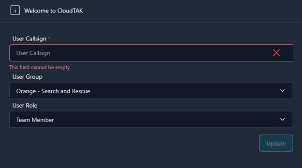

We recommend using the callsign convention [agency acronym] [last name] and [radio callsign]. Next decide which color your marker will show as on the map. View this table to see which color you should choose.

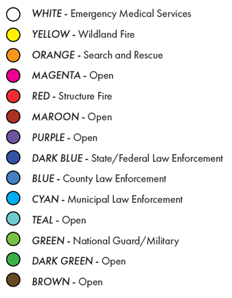

Finally, choose your role based on the table provided. When in doubt choose the Team Member option.

You will be prompted: map.cotak.gov wants to Know your Location. Select “Allow".

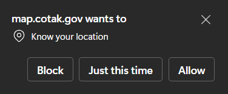

If your device has a GPS chip, it will automatically update your location. If not, you will need to manually set your location. Click on the location button on the bottom left corner and select your location on the map.

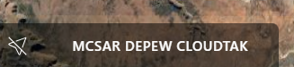

Moving the map and clicking on your callsign will recenter the map on your location.

To navigate the map, click and drag. To rotate the map, hold control, then click and drag left or right. While holding control, click and drag up or down to change the perspective on the map.  Zoom in and out using the mouse wheel or the plus and minus buttons in the top right corner.

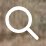 At the top of the left panel is the search tool. Here you may enter in an address similar to how you would use a navigation system. When you find the correct address, click on it, and your map will automatically position itself at that exact location.

## Draw Tools

.png) 

Click on the pencil icon in the top right corner to open the drawing tool options.

**Coordinate Input:** Place a marker of your choice at the coordinates that you enter

**Range & Bearing:** Create a line of specified bearing and distance originating from chosen coordinates.

**Range Rings:** Create rings at specified distances from the point of origin. Useful for evacuation operations, searches, and manhunts.

 **Draw Point:** Opens a window with 5 different points to choose from. Select the desired icon then click on the map to drop the point. Click on the point to access the radial menu.

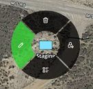

 Edit location of point by clicking and dragging.

 Delete point.

 Lock on point. Note that this feature was created for moving markers and integration such as aircrafts or GPS trackers.

 Open side menu to edit point. From here you can edit name, coordinates, icon style, add notes or attachments, and share with other users through the share button.

CloudTAK supports many iconsets (view them by clicking Style ->Select Icon). Note that specialty icon sets may not be supported by other TAK Clients. If they are unsupported they will often be received as a yellow clover icon.

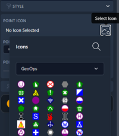

**Draw Line:** Place points on the map to create a straight line between them. Double click to finish the line. Clicking on the finished line gives you access to the same radial menu as for markers. The Edit button allows you to add accuracy.

**Draw Polygon**: Create any type of shape. Click to put at least two points on the map then double click at the last point to close the shape. Clicking on any shape will give you access to the same radial menu as for markers and lines. You can edit color, opacity, line style, and center coordinates.

**Draw Rectangle**: Draw a rectangle in any orientation of your choosing. Drop your first and second point to draw the height of the rectangle. Then use the third point to create the width of the rectangle. Clicking on any shape will give you access to the same radial menu as for markers and lines. You can edit color, opacity, line style, and center coordinates.

 **Draw Circle**: Draw a circle of any size. First click is center, second click is perimeter. Clicking on any shape will give you access to the same radial menu as for markers and lines. You can edit color, opacity, line style, and center coordinates.

**Draw Sector:** Draw a sector of any size. First click is the center point, second click is the perimeter.Clicking on any shape will give you access to the same radial menu as for markers and lines. You can edit color, opacity, line style, and center coordinates.

 **Lasso Select:** Creates a lasso to select any features on your map. Single click to start, single click to finish. After features have been selected, they can be shared, deleted, added to a Data Package, or added to a Data Sync.

**GeoJSON Import:** Allows you to import smaller GeoJSONS. Icons imported this way instead of through the Imports tool show up in "Your Features."  Each feature is editable so you can change the icon type or location. However, they are features on your map, not an overlay, so you can't toggle them on or off.

## Menu

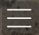 Click the three lines (hamburger) at the top right of the page to view the menu.

## Your Features

All features created by you or or shared to you by other users can be viewed here. Click on a feature to snap to it on the map. All features are editable. You can easily delete features or recover recently deleted features.

## Overlays

Allows you to toggle layers on or off of your basemap. Click the eye icon to turn overlays on or off. Click the plus button in the top right corner to add additional pre-existing overlays such as NOAA radar, cell coverage maps, and county boundaries. See information on adding custom overlays under Imports.

## Contacts

Will show a list of all contacts that are online and those who recently closed their TAK application or lost connection with the TAK server. You may search for specific contacts in the filter search bar. Clicking on an online contact will reposition your map to their location. Clicking the chat bubble next to their name will open a chat with that contact.

## Base Maps

Allows you to change the current basemap displayed on CloudTAK. Feel free to choose whichever basemap best suits your needs.

## Data Sync (Missions)

Data Sync is a tool that creates a mission, also known as a feed, which is like a folder for custom data sets, and is hosted within the TAK Server. It allows synchronization of data between multiple devices. Any data in the feed is synchronized to all TAK app users who have subscribed to that feed. This sync happens immediately if the users are connected to the TAK Server, or will happen as soon as a user reconnects to the Server. As a result, data sync is the best method in TAK to ensure that all members of a team receive identical data when planning an operation. Conversely, items deleted by the DataSync feed creator will disappear from users’ maps. This is useful for de-cluttering maps after an incident is complete.

**To create a new Data Sync**: 

Click the plus button on the top right corner. 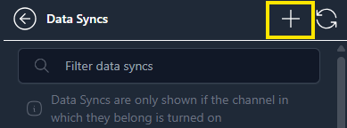

Name your Data Sync and select the channel or channels you want it to be available on. 

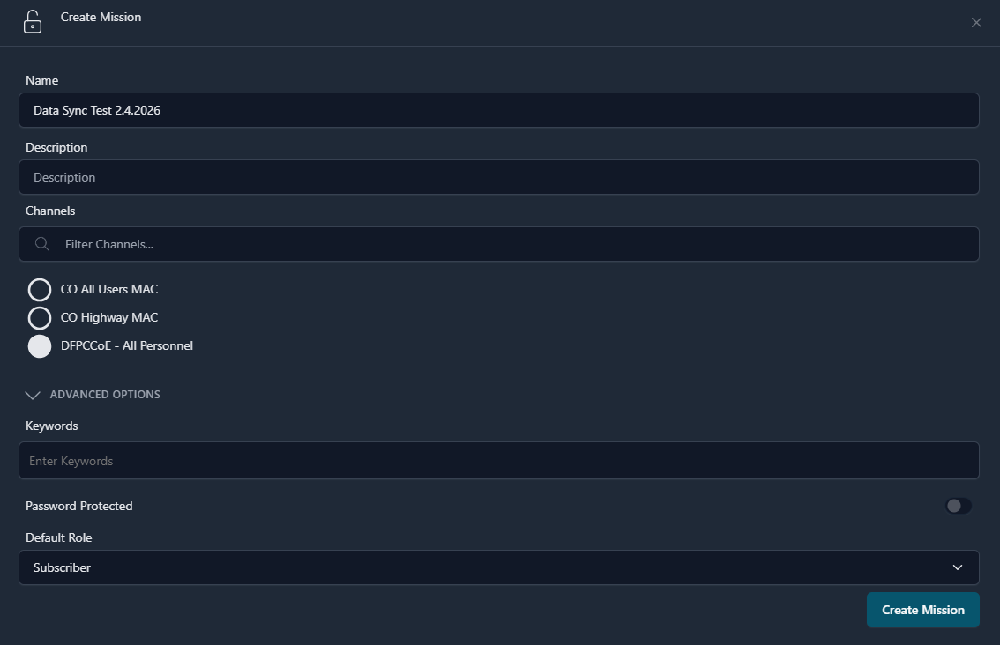

(Note: Only channels you currently have turned on will be displayed as options). Advanced Options allows you to password protect your Data Sync and control whether users are Owners (Able to subscribe to, edit, and delete the Data Sync), Subscribers (default, able to subscribe to and edit the Data Sync) or Viewers (able to subscribe to the Data Sync but not able to make any edits).

Click "Make Active""

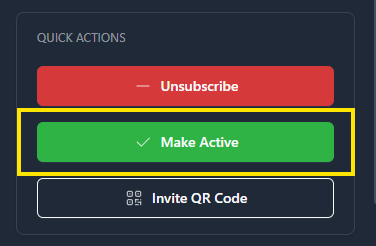

Selecting “Make Active” will cause the mission to display on the top left corner. 

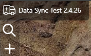

While the Data Sync is active, any features you create in CloudTAK will automatically be added to the Data Sync. 

You can also add existing features to the Data Sync by selecting features with the Lasso Tool (see Drawing Tools), clicking the three dots, and selecting "Move to Data Sync."

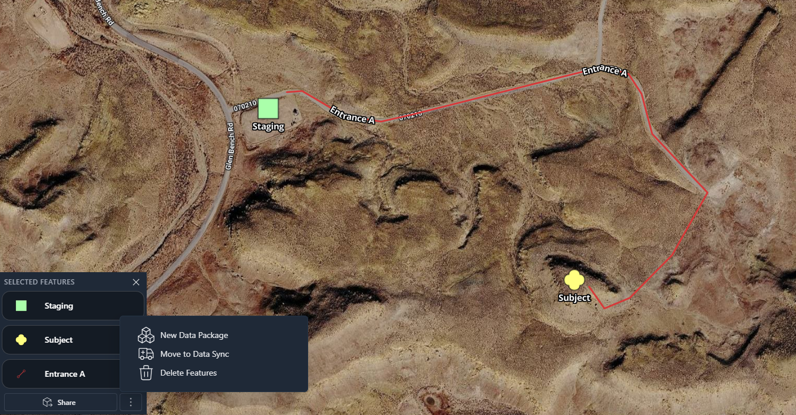

**To subscribe to an existing Data Sync:** 

Make sure you have the channel associated with the Data Sync turned on. Select Data Sync, then select “Subscribe.” All features in the Data Sync will now appear live on your map.

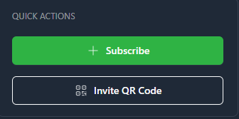

If you wish to add features to this Data Sync, click "Make Active." While the data sync is active, any features you create in CloudTAK will automatically be added to the Data Sync. After clicking "Deactivate," features you create will no longer automatically be added to the Data Sync, but the Data Sync will continue to update. 

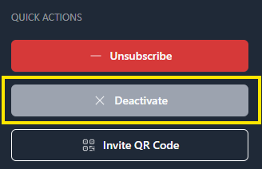

Some Data Syncs (such as the CDOT cameras) will not allow the “Make Active” option. To unsubscribe and remove the Data sync features from your map, click “Unsubscribe.” 

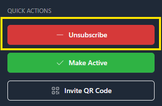

## Data Packages

A tool to bundle items you might want to share with other TAK users. To create a new Data Package use the Lasso Tool (see Drawing Tools) to select existing features on your map. After lassoing your features, a menu will appear displaying captured features.

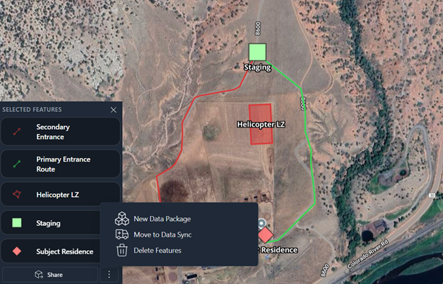

Click the three dots, then “New Data Package”

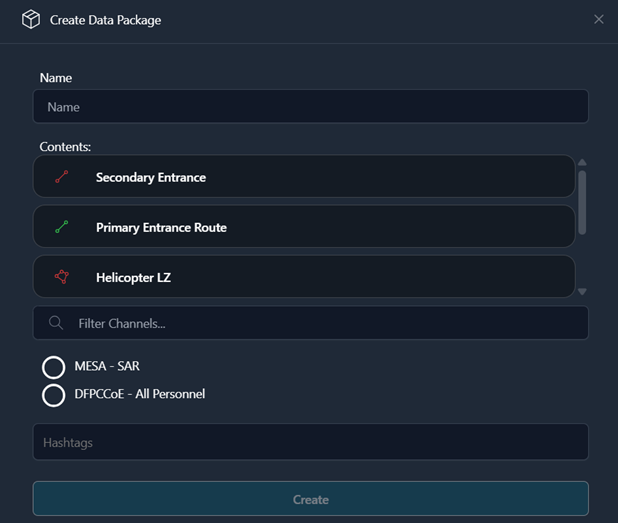

Name your Data Package, and select the channel or channels you want this data to be available on. (Note: Only channels you currently have turned on will be displayed as options). If desired, you can add a file to your data package. 

You can also use the Plus button on the right side under Data Package to create a new package.

## Channels

Will display all channels available to your COTAK account. 

 An open eyeball icon indicates that the channel is currently on and is sharing your location with all other users on that same channel. 

 Toggling this icon to the off position (eyeball with slash through it) removes your location and presence from that channel. 

To the right of the channels you will also see a pointer arrow icon.

 An arrow icon indicates that users who are active on this channel can see each other. 

 An arrow with a slash indicates that users on this channel cannot see each other. Instead, these channels are used to supply you with additional data such as Aircraft locations or Wildland Fire data. 

Each COTAK emergency responder sees a unique list of channels. Some of these channels were created by your agency administrator and are only available to members of your public safety organization, while other channels are available to multiple agencies for use in mutual aid. It is best practice to only turn on mutual aid channels when a need for them arises, but refer to your own agency’s policies for definitive guidance. 

## Videos

Use the left tab (Streams) to view any video feeds that are currently available. If you get a Video Server Error, the video is either not currently being broadcasted or not in a format that is supported by CloudTAK. Use the right tab (Leases) to set up a video lease to broadcast your video stream from a UAS or other source to TAK. This will allow you to broadcast your video stream live to other TAK users on your channel. For more information on how to set up video leases for a UAS see the following videos:

 [UAS Tool Pt 1: Downloading and Operating UAS Tool](https://cotak.gov/pages/tak-integrations/uas-tool-pt1-downloading-and-operating-uas-tool)

[UAS Tool Pt 2: Streaming CloudTAK Leases](https://cotak.gov/pages/tak-integrations/uas-tool-pt-2-fmv-streaming-cloudtak-leases)

## Chat

Displays all of your current chats. To start a new chat, click the plus button on the top right corner.

## Routes

Allows you to create and save routes from one address to another. You can either freehand the route by using "No Snapping," or select "Roads & Trails" to snap to routes.

Click once to start route and twice to finish. Route can then be edited and shared like any other feature.

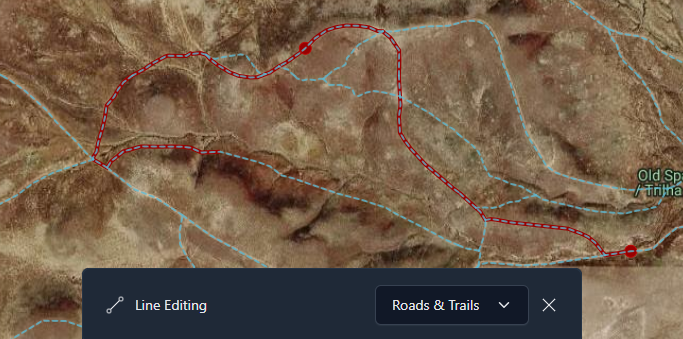

## Uploaded Files

All files uploaded through “Imports” will be displayed here. Click on an uploaded file to view options. “Add to Map as Overlay” will cause the file to appear on the map and in your “Overlays” tool. From the Overlays tool it can be toggled on or off using the eyeball. You can also download the file, add it to an existing Data Sync or Data Package, and rename or delete the file. 

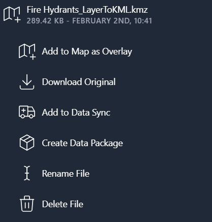

## Imports

Displays all imported files. To import a new file, Select the “New Import” icon  on the top right side to upload files from your desktop. 

## Settings

Allows you to change your callsign, device preferences, and preferred settings such as unit type.
