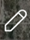

# CloudTAK User Guide

## First Login

## Settings

## Basemaps

## Your Features

## Draw Tools

  The pencil icon in the top right corner opens the drawing tool options.

 Place a marker of your choice at the coordinates that you enter.

 Create a line of specified bearing and distance originating from chosen coordinates.

 Create rings at specified distances from the point of origin. Useful for evacuation operations, searches, and manhunts.

 Opens a window with 5 different points to choose from. Select the desired icon then click on the map to drop the point. Click on the point to access the radial menu.

 Delete point.

 Edit location of point by clicking and dragging.

 Lock on point. Note that this feature is more useful for moving points such as aircrafts.

 Open side menu to edit point. From here you can edit name, coordinates, icon style, add notes or attachments, and share with other users through the share button.

CloudTAK supports many iconsets (view them by clicking Style ->Select Icon). Note that specialty icon sets may not be supported by other TAK Clients. If they are unsupported they will often be received as a yellow clover icon.

 Place points on the map to create a straight line between them. Double click to finish the line. Clicking on the finished line gives you access to the same radial menu as for markers. The Edit button allows you to add accuracy.

 Create any type of shape. Click to put at least two points on the map then double click at the last point to close the shape. Clicking on any shape will give you access to the same radial menu as for markers and lines. You can edit color, opacity, line style, and center coordinates.

 Draw a rectangle in any orientation of your choosing. Drop your first and second point to draw the height of the rectangle. Then use the third point to create the width of the rectangle.

 Draw a circle of any size.

 Draw a sector of any size. First click is the center point, second click is the perimeter.

 Creates a lasso to select any features on your map. Single click to start, single click to finish. After features have been selected, they can be shared, deleted, added to a Data Package, or added to a Data Sync.

 Allows you to import smaller GeoJSONS. Icons imported this way instead of through the Imports tool show up in "Your Features."  Each feature is editable so you can change the icon type or location. However, they are features on your map, not an overlay, so you can't toggle them on or off.

## Overlays

## Notifications

## Data Packages

## Data Sync (Missions)

Data Sync allow synchronization of data between multiple devices. Data Sync allow a team member to generate data and as field members go in and out of connectivity, their data will be synchronized with the team.

## Channels

## Videos

## Chat

## Routes

## Your Files & Imports

## Iconsets

## Connections (Advanced)

## Debugger (Advanced)
