# CloudTAK User Guide

## First Login

Go to your agency login page and log in with your credentials.

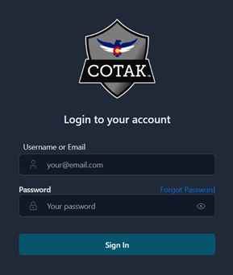

The first time you log in, you must set your callsign and device preferences.

We recommend using the following callsign convention: `[Agency Acronym] [Last Name] [Radio Callsign]`.

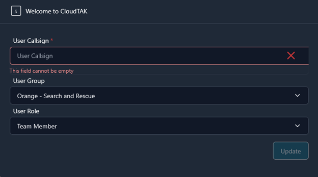

Decide which color your marker will show as on the map. Use this table to see which color you should choose.

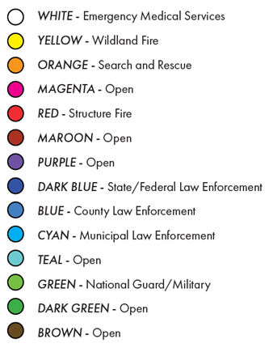

Choose your role based on the table provided. When in doubt, choose the Team Member option.

Select "Allow" if prompted that your server wants to know your location.

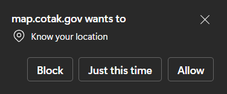

If your device has a GPS chip, it will automatically update your location. If not, you will need to set your location manually: click the location button in the bottom left corner and select your location on the map.

Moving the map and clicking on your callsign will recenter the map on your location.

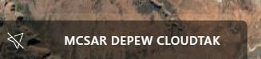

To navigate the map, click and drag. To rotate the map, hold control, then click and drag left or right. While holding control, click and drag up or down to change the perspective on the map. Zoom in and out using the mouse wheel or the plus and minus buttons in the top right corner.

{ .icon } At the top of the left panel is the search tool. Here you may enter an address similar to how you would use a navigation system. When you find the correct address, click on it, and your map will automatically position itself at that exact location.

## Draw Tools

Click the pencil icon in the top right corner to open the drawing tool options.

- **Coordinate Input:** Place a marker of your choice at the coordinates that you enter.
- **Range & Bearing:** Create a line of specified bearing and distance originating from chosen coordinates.
- **Range Rings:** Create rings at specified distances from the point of origin. Useful for evacuation operations, searches, and manhunts.
- **Draw Point:** Opens a window with 5 different points to choose from. Select the desired icon then click on the map to drop the point.
- **Draw Line:** Place points on the map to create a straight line between them. Double click to finish the line. The Edit button allows you to add accuracy.
- **Draw Polygon:** Create any type of shape. Click to put at least two points on the map then double click at the last point to close the shape.
- **Draw Rectangle:** Draw a rectangle in any orientation of your choosing. Drop your first and second point to draw the height of the rectangle, then use the third point to create the width.
- **Draw Circle:** First click is the center, second click is the perimeter.
- **Draw Sector:** First click is the center point, second click is the perimeter.
- **Lasso Select:** Single click to start, single click to finish. Selected features can be shared, deleted, added to a Data Package, or added to a Data Sync.
- **GeoJSON Import:** Import smaller GeoJSON files. Features imported this way, instead of through the Imports tool, show up in "Your Features" and are each editable, but they are features on your map rather than an overlay, so you can't toggle them on or off.

.png)

Click on a point or shape to open the radial menu. All geometric shapes share this menu, and also let you edit color, opacity, line style, and center coordinates.

{ .icon } Edit the location of the point by clicking and dragging.

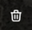{ .icon } Delete the point.

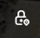{ .icon } Lock on the point. This feature was created for moving markers and integrations such as aircraft or GPS trackers.

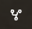{ .icon } Open the Buffer Geometry tool.

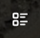{ .icon } Open the side menu to edit the point.

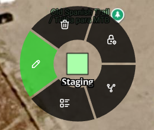

**Buffer Geometry** creates a perimeter with a radius of a specified distance around your point.

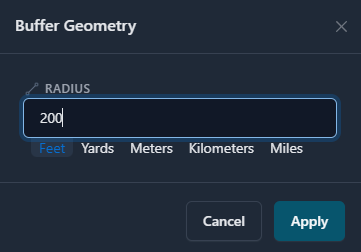
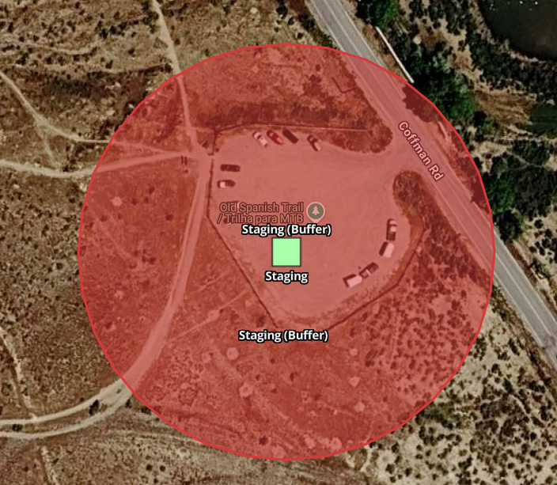

From the **edit side menu** you can change the name, coordinates and icon style, add notes or attachments, and share with other users through the share button { .icon }.

CloudTAK supports many iconsets (view them by clicking Style, then Select Icon). Specialty icon sets may not be supported by other TAK clients, and if unsupported they will often be received as a yellow clover icon.

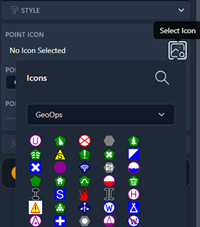

## Menu

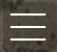{ .icon } Click the three lines (hamburger) at the top right of the page to view the menu.

### Your Features

All features created by you or shared to you by other users can be viewed here. Click on a feature to snap to it on the map. All features are editable. You can easily delete features or recover recently deleted features.

### Overlays

Allows you to toggle layers on or off of your basemap. Click the eye icon to turn overlays on or off. Click the plus button in the top right corner to add additional pre-existing overlays such as NOAA radar, cell coverage maps, and county boundaries. See information on adding custom overlays under Imports.

### Contacts

Shows a list of all contacts that are online and those who recently closed their TAK application or lost connection with the TAK server. You may search for specific contacts in the filter search bar. Clicking on an online contact will reposition your map to their location. Clicking the chat bubble next to their name will open a chat with that contact.

### Base Maps

Allows you to change the current basemap displayed on CloudTAK. Feel free to choose whichever basemap best suits your needs.

### Data Sync (Missions)

Data Sync is a tool that creates a mission, also known as a feed, which is like a folder for custom data sets, and is hosted within the TAK Server. It allows synchronization of data between multiple devices. Any data in the feed is synchronized to all TAK app users who have subscribed to that feed. This sync happens immediately if the users are connected to the TAK Server, or as soon as a user reconnects to the Server. As a result, data sync is the best method in TAK to ensure that all members of a team receive identical data when planning an operation. Conversely, items deleted by the Data Sync feed creator will disappear from users' maps. This is useful for de-cluttering maps after an incident is complete.

#### Creating a Data Sync

Click the plus button in the top right corner.

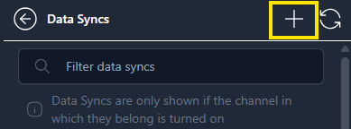

Name your Data Sync and select the channel or channels you want it to be available on. Only channels you currently have turned on are displayed as options.

Advanced Options allows you to password protect your Data Sync and control whether users are:

- **Owners:** able to subscribe to, edit, and delete the Data Sync
- **Subscribers** (default): able to subscribe to and edit the Data Sync
- **Viewers:** able to subscribe to the Data Sync but not make any edits

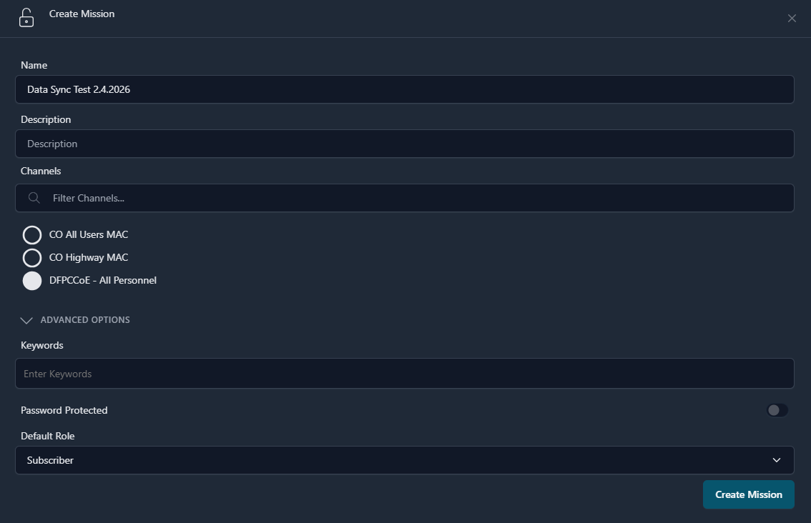

Click **Make Active**.

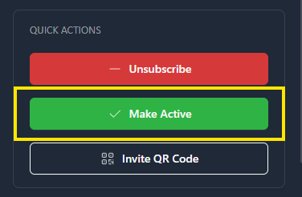

The active mission is displayed in the top left corner. While the Data Sync is active, any features you create in CloudTAK are automatically added to it.

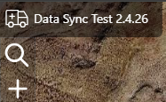

To add existing features, select them with the Lasso Tool (see [Draw Tools](#draw-tools)), click the three dots, and select **Move to Data Sync**.

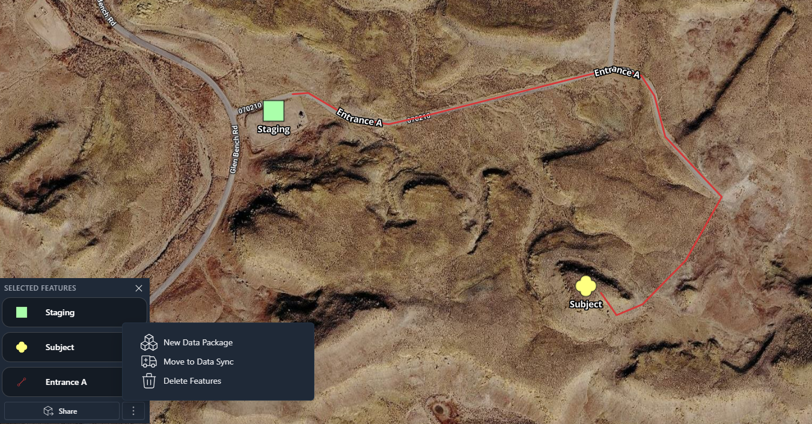

#### The Data Sync Menu

Any Data Sync you are subscribed to has a menu, displayed on the right side. A shortcut to this menu also appears in the top left next to your active mission.

{ .icon } **Layers:** Displays all features added to this Data Sync.

{ .icon } **Files:** Displays all files added to the Data Sync.

{ .icon } **Chats:** Chat for all users subscribed to the Data Sync.

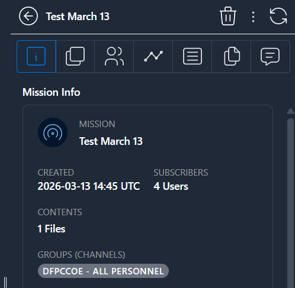
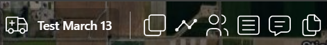

{ .icon } **Users:** Displays all users subscribed to this Data Sync. Click the plus button to send users a request to join the Data Sync.

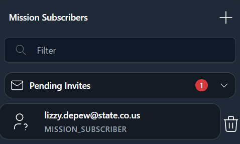

{ .icon } **Changes:** Displays a log of all added and deleted features, including the date and time the change was made.

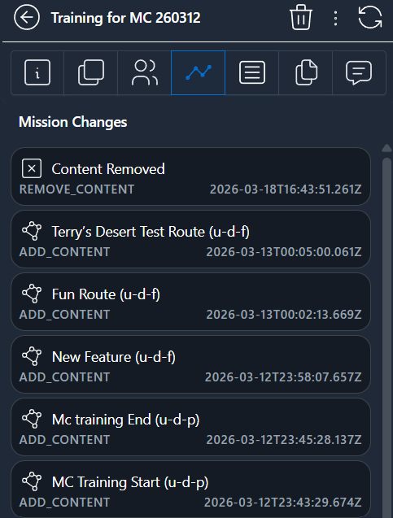

{ .icon } **Logs:** Allows for documentation of the mission. Logs can be downloaded as a .csv by clicking **Save Log**.

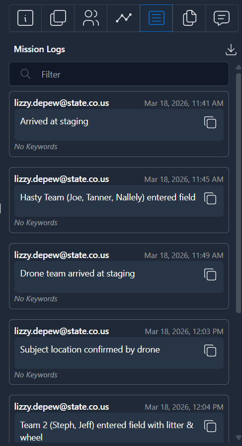

#### Subscribing to an existing Data Sync

Make sure you have the channel associated with the Data Sync turned on. Select the Data Sync, then select **Subscribe**. All features in the Data Sync will now appear live on your map.

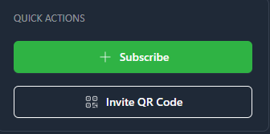

To add features to this Data Sync, click **Make Active**. While the Data Sync is active, any features you create in CloudTAK are automatically added to it. After clicking **Deactivate**, features you create are no longer added, but the Data Sync will continue to update.

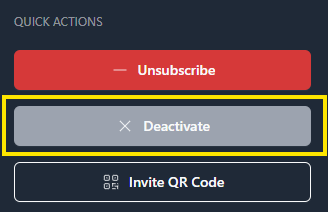

To unsubscribe and remove the Data Sync features from your map, click **Unsubscribe**. Some Data Syncs (such as the CDOT cameras) do not allow the **Make Active** option.

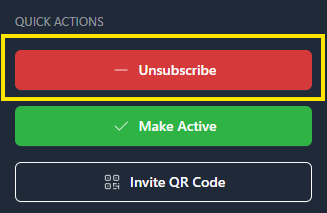

### Data Packages

A tool to bundle items you might want to share with other TAK users.

#### Creating a Data Package

Use the Lasso Tool (see [Draw Tools](#draw-tools)) to select existing features on your map. A menu will appear displaying the captured features.

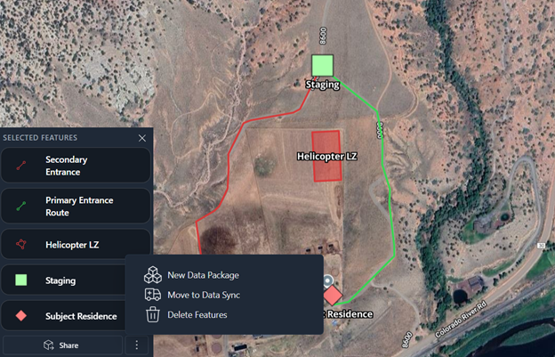

Click the three dots, then **New Data Package**.

You can also use the plus button on the right side under Data Packages to create a new package.

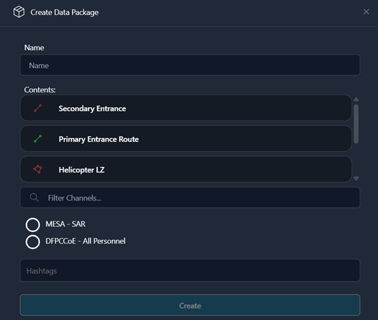

Name your Data Package and select the channel or channels you want this data to be available on. Only channels you currently have turned on are displayed as options. If desired, you can add a file to your data package.

!!! note
    Data Packages are cleared from the server every two months. To keep a Data Package available on your channel indefinitely, add `#permanent` under "Hashtags".

#### Importing an existing Data Package

Ensure the correct channel is on, then select the Data Package and click **Import Package**. This imports all features in the data package.

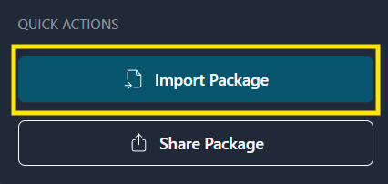

If the data package has a file such as a KMZ attached, select the file under **Import Results**. This adds the file to your overlays.

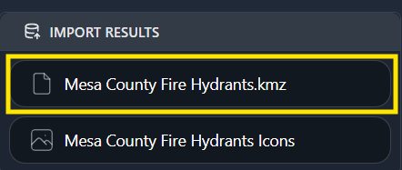

## Channels

Displays all channels available to your account.

{ .icon } An open eyeball icon indicates that the channel is currently on and is sharing your location with all other users on that same channel.

{ .icon } Toggling this icon to the off position (eyeball with slash through it) removes your location and presence from that channel.

To the right of the channels you will also see a pointer arrow icon.

{ .icon } An arrow icon indicates that users who are active on this channel can see each other.

{ .icon } An arrow with a slash indicates that users on this channel cannot see each other. Instead, these channels are used to supply you with additional data such as aircraft locations or wildland fire data.

Each user sees a unique list of channels. Some of these channels were created by your agency administrator and are only available to members of your public safety organization, while other channels are available to multiple agencies for use in mutual aid. It is best practice to only turn on mutual aid channels when a need for them arises, but refer to your own agency's policies for definitive guidance.

### Videos

Use the left tab (Streams) to view any video feeds that are currently available. If you get a Video Server Error, the video is either not currently being broadcast or not in a format that is supported by CloudTAK. Use the right tab (Leases) to set up a video lease to broadcast your video stream from a UAS or other source to TAK. This will allow you to broadcast your video stream live to other TAK users on your channel. For more information on how to set up video leases for a UAS see the following videos:

- [UAS Tool Pt 1: Downloading and Operating UAS Tool](https://cotak.gov/pages/tak-integrations/uas-tool-pt1-downloading-and-operating-uas-tool)
- [UAS Tool Pt 2: Streaming CloudTAK Leases](https://cotak.gov/pages/tak-integrations/uas-tool-pt-2-fmv-streaming-cloudtak-leases)

### Chat

Displays all of your current chats. To start a new chat, click the plus button in the top right corner.

### Routes

Routes lets you create and save routes from one address to another. Either freehand the route with **No Snapping**, or select **Roads & Trails** to snap to routes.

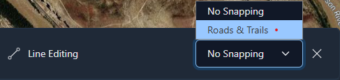

Click once to start the route and twice to finish. The route can then be edited and shared like any other feature.

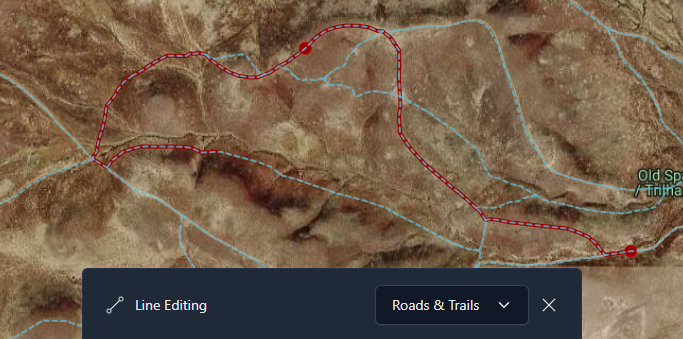

### Uploaded Files

All files uploaded through Imports are displayed here. Click on an uploaded file to view its options.

- **Add to Map as Overlay** makes the file appear on the map and in your Overlays tool, where it can be toggled on or off using the eyeball.
- You can also download the file, add it to an existing Data Sync or Data Package, and rename or delete the file.

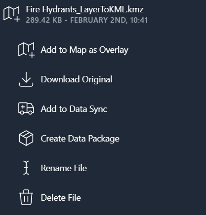

### Imports

Displays all imported files. To import a new file, select the New Import icon { .icon } in the top right to upload files from your desktop.

### Settings

Allows you to change your callsign, device preferences, and preferred settings such as unit type.
